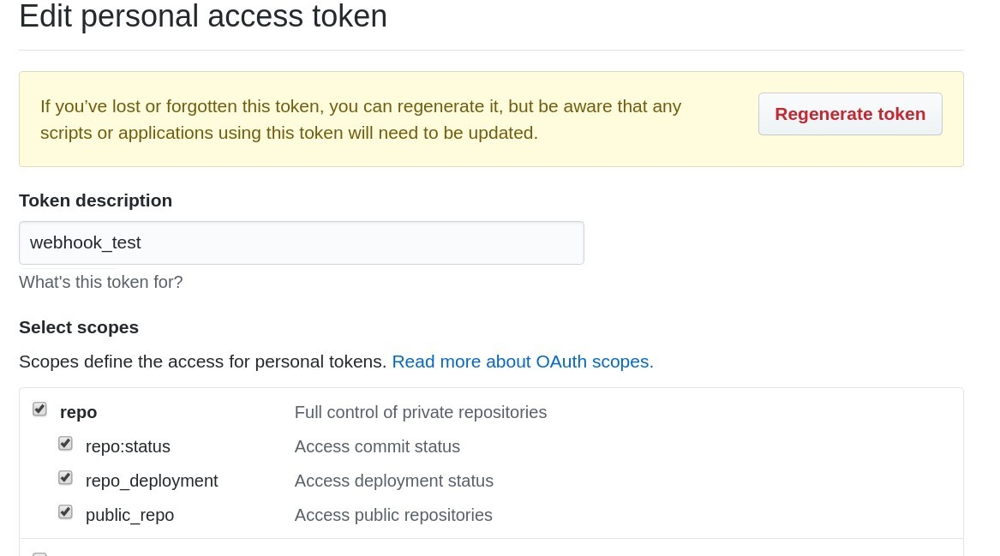

# GitHub checkbox checker


## Requirements

- Go 1.7 or later

## Build

```bash
go get -u -v ./...
CGO_ENABLED=0 go build
```

## Preparation

### Get Personal access token

https://github.com/settings/tokens

Required scopes of OAuth2 is `Full control of private repositories`.



### Install Webhook

- URL path of Payload URL must be `/payload`
- Content type must be `application.json`
- Required event is `Issues`


## Run

```bash
GITHUB_WEBHOOK_SECRET=<secret> GITHUB_ACCESS_TOKEN=<access-token> ./github_checkbox_checker
```
